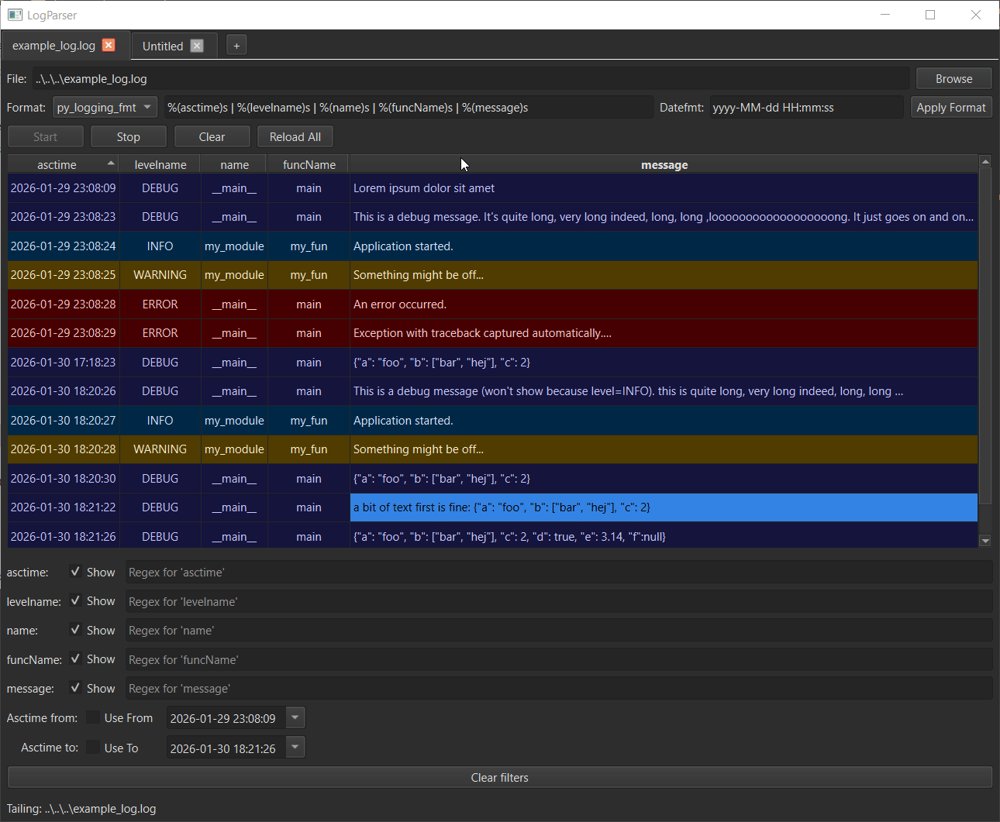

# LogParser (C++ / Qt 6)

A lightweight but powerful log viewer written in **C++17** with **Qt 6**.

Parses lines into columns and filters on a per-column basis, both using regex for maximal flexibility. 

For messages containing JSON data, a separate dialog allows the user to format the json and use JSONPath style filtering of the data.

  

---

## ✨ Features

- **Multi‑tab** live tailing (create tabs with `Ctrl+T`)
- **Two parsing modes**
  - `py_logging_fmt` → converts `%(asctime)s %(levelname)s … %(message)s` to a regex, easy to copy-paste directly from your python logging setup
  - `regex` → your named-group pattern (e.g., `(?<asctime>...) (?<levelname>...) (?<message>.*)`) for full flexibility
- **Dynamic table columns** with level-based coloring
- **Per‑column regex filters** + **time‑range filter** on `asctime`
- **Time-aware sorting** (true chronological sort by `asctime`)
- **Unread badges** on tabs using **colored dot icons** (green dot = new activity, red dot = new error) for easy overview when using multiple tabs
- **“First new row”** when switching to another tab, a green line within the table will show the user what lines are unread/new
- **Copy** multiple selected cells to clipboard with `Ctrl+C`
- **Message dialog** by double-clicking a message
  - shows full message, practical for very long messages
  - Pretty JSON formatting + Text search/highlight
  - Auto-detect **embedded JSON fragments** inside text
  - Foldable JSON tree view
  - Mini JSONPath: `$['key'][0]['nested']` to view subsets of the json data

---

## 🚀 Building

This repo ships with **CMake Presets**. You can configure & build with one line.

### Prerequisites

- Qt **6.10.2** installed
  - MinGW kit: (e.g. `C:/Qt/6.10.2/mingw_64`) added to QT_ROOT
  - MinGW toolchain: (e.g. `C:/Qt/Tools/mingw1310_64/bin`) added to PATH
- CMake **3.21+**

### Configure & build (MinGW, Release)

```powershell
cmake --preset mingw-release
cmake --build --preset mingw-release -j
```

### Configure & build (MinGW, Debug)

```powershell
cmake --preset mingw-debug
cmake --build --preset mingw-debug -j
```

Feel free to use the `run_build.bat` script to build and install. Just make sure to edit the paths inside to your local Qt installation.

---

## ▶️ Run

From the build folder:

```powershell
.\build\mingw-release\log_parser.exe
```

Run with one or more files to open them directly:

```powershell
.\log_parser.exe C:\logs\app.log C:\logs\server.txt
```

---

## 📦 Install / Deploy

This project uses Qt’s `qt_generate_deploy_app_script(...)`. After building:

```powershell
cmake --install build\mingw-release
```

You’ll get a self-contained folder (Qt DLLs/plugins are copied) at:

```
install\mingw-release\bin\log_parser.exe
```

---

## 🧑‍💻 Usage quick‑start

- **Choose file** → **Reload All** to load the full file, **Start** to tail for live updates.
- **Apply Format** with `py_logging_fmt` or `regex` to parse columns. The column `asctime` enables time filters & chronological sorting.
- Type regex in any column filter field (invalid patterns are tinted red).
- Enable **Use From/To** to filter by time.
- **Double-click** a row for the message dialog popup:
  - Enter free form text in the search bar to highlight text
  - If the message contains (but not necessarily solely) a JSON, enter `$['key'][0]['anotherkey']` in the JSON filter to view a subtree.
